# Execution Plan - Portal de Gestión de Visitas Mecánicas

## Detailed Analysis Summary

### Change Impact Assessment
- **User-facing changes**: Sí — portal completo nuevo con múltiples pantallas y roles
- **Structural changes**: Sí — arquitectura nueva (frontend TanStack + API Gateway + Lambda)
- **Data model changes**: Sí — modelo de visitas, catálogos, usuarios (mock inicialmente)
- **API changes**: Sí — endpoints REST nuevos para todas las operaciones
- **NFR impact**: Sí — seguridad (Clerk + Security Baseline), IaC, CI/CD

### Risk Assessment
- **Risk Level**: Medium
- **Rollback Complexity**: Easy (greenfield, no sistema existente que afectar)
- **Testing Complexity**: Moderate (múltiples roles, estados, transiciones)

---

## Workflow Visualization

```mermaid
flowchart TD
    Start(["Solicitud del Usuario"])
    
    subgraph INCEPTION["INCEPTION PHASE"]
        WD["Workspace Detection<br/>COMPLETED"]
        RA["Requirements Analysis<br/>COMPLETED"]
        US["User Stories<br/>COMPLETED"]
        WP["Workflow Planning<br/>COMPLETED"]
        AD["Application Design<br/>EXECUTE"]
        UG["Units Generation<br/>EXECUTE"]
    end
    
    subgraph CONSTRUCTION["CONSTRUCTION PHASE"]
        FD["Functional Design<br/>EXECUTE"]
        NFRA["NFR Requirements<br/>EXECUTE"]
        NFRD["NFR Design<br/>EXECUTE"]
        ID["Infrastructure Design<br/>EXECUTE"]
        CG["Code Generation<br/>EXECUTE"]
        BT["Build and Test<br/>EXECUTE"]
    end
    
    Start --> WD
    WD --> RA
    RA --> US
    US --> WP
    WP --> AD
    AD --> UG
    UG --> FD
    FD --> NFRA
    NFRA --> NFRD
    NFRD --> ID
    ID --> CG
    CG --> BT
    BT --> End(["Complete"])

    style WD fill:#4CAF50,stroke:#1B5E20,stroke-width:3px,color:#fff
    style RA fill:#4CAF50,stroke:#1B5E20,stroke-width:3px,color:#fff
    style US fill:#4CAF50,stroke:#1B5E20,stroke-width:3px,color:#fff
    style WP fill:#4CAF50,stroke:#1B5E20,stroke-width:3px,color:#fff
    style AD fill:#FFA726,stroke:#E65100,stroke-width:3px,stroke-dasharray: 5 5,color:#000
    style UG fill:#FFA726,stroke:#E65100,stroke-width:3px,stroke-dasharray: 5 5,color:#000
    style FD fill:#FFA726,stroke:#E65100,stroke-width:3px,stroke-dasharray: 5 5,color:#000
    style NFRA fill:#FFA726,stroke:#E65100,stroke-width:3px,stroke-dasharray: 5 5,color:#000
    style NFRD fill:#FFA726,stroke:#E65100,stroke-width:3px,stroke-dasharray: 5 5,color:#000
    style ID fill:#FFA726,stroke:#E65100,stroke-width:3px,stroke-dasharray: 5 5,color:#000
    style CG fill:#4CAF50,stroke:#1B5E20,stroke-width:3px,color:#fff
    style BT fill:#4CAF50,stroke:#1B5E20,stroke-width:3px,color:#fff
    style Start fill:#CE93D8,stroke:#6A1B9A,stroke-width:3px,color:#000
    style End fill:#CE93D8,stroke:#6A1B9A,stroke-width:3px,color:#000
    style INCEPTION fill:#BBDEFB,stroke:#1565C0,stroke-width:3px,color:#000
    style CONSTRUCTION fill:#C8E6C9,stroke:#2E7D32,stroke-width:3px,color:#000
    linkStyle default stroke:#333,stroke-width:2px
```



### Text Alternative
```
INCEPTION PHASE:
  1. Workspace Detection     -> COMPLETED
  2. Requirements Analysis   -> COMPLETED
  3. User Stories            -> COMPLETED
  4. Workflow Planning       -> COMPLETED
  5. Application Design     -> EXECUTE
  6. Units Generation       -> EXECUTE

CONSTRUCTION PHASE (per unit):
  7. Functional Design       -> EXECUTE
  8. NFR Requirements        -> EXECUTE
  9. NFR Design              -> EXECUTE
  10. Infrastructure Design  -> EXECUTE
  11. Code Generation        -> EXECUTE (ALWAYS)
  12. Build and Test         -> EXECUTE (ALWAYS)
```

---

## Phases to Execute

### INCEPTION PHASE
- [x] Workspace Detection (COMPLETED)
- [x] Requirements Analysis (COMPLETED)
- [x] User Stories (COMPLETED)
- [x] Workflow Planning (COMPLETED)
- [ ] Application Design - EXECUTE
  - **Rationale**: Proyecto nuevo con múltiples componentes (frontend pages, API endpoints, Lambda functions). Necesita definición de componentes, métodos y dependencias entre capas.
- [ ] Units Generation - EXECUTE
  - **Rationale**: El proyecto tiene frontend, backend API y infraestructura como capas distintas. Descomponer en unidades permite desarrollo estructurado y paralelo.

### CONSTRUCTION PHASE (per unit)
- [ ] Functional Design - EXECUTE
  - **Rationale**: Modelo de datos complejo (visitas con estados, transiciones, historial, catálogos). Lógica de negocio con reglas de transición de estados y permisos por rol.
- [ ] NFR Requirements - EXECUTE
  - **Rationale**: Security Baseline habilitado (15 reglas), PBT habilitado, selección de tech stack para IaC, librería de calendario y gráficas.
- [ ] NFR Design - EXECUTE
  - **Rationale**: Patrones de seguridad, logging estructurado, rate limiting, error handling necesitan diseño explícito.
- [ ] Infrastructure Design - EXECUTE
  - **Rationale**: API Gateway + Lambda + IaC + 3 ambientes (dev/staging/prod) requieren diseño de infraestructura.
- [ ] Code Generation - EXECUTE (ALWAYS)
  - **Rationale**: Generación de código para frontend, backend y infraestructura.
- [ ] Build and Test - EXECUTE (ALWAYS)
  - **Rationale**: Instrucciones de build, tests unitarios, integración y PBT.

### Skipped Stages
- Reverse Engineering - SKIP (greenfield, no hay código existente)

---

## Success Criteria
- **Primary Goal**: Portal funcional con routing, auth, una pantalla conectada a Lambda con datos mock
- **Key Deliverables**:
  - Repo con TanStack Start + Router + layout shell
  - Auth con Clerk (login, logout, rutas protegidas)
  - Al menos una pantalla conectada a Lambda (datos mock)
  - IaC para 3 ambientes (dev/staging/prod)
  - GitHub Actions pipeline (lint + type-check + build)
- **Quality Gates**:
  - TypeScript strict sin errores
  - Security Baseline compliance (SECURITY-01 a SECURITY-15)
  - PBT compliance (PBT-01 a PBT-10) con fast-check
  - Todas las rutas protegidas por rol
